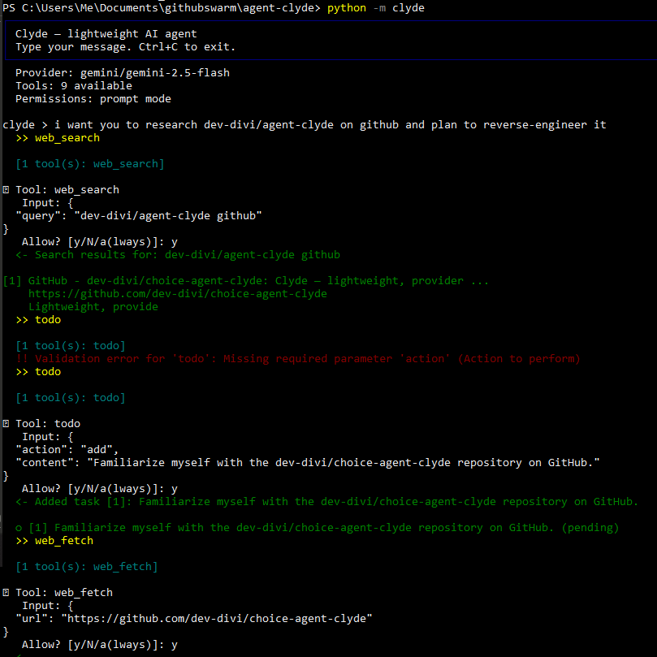
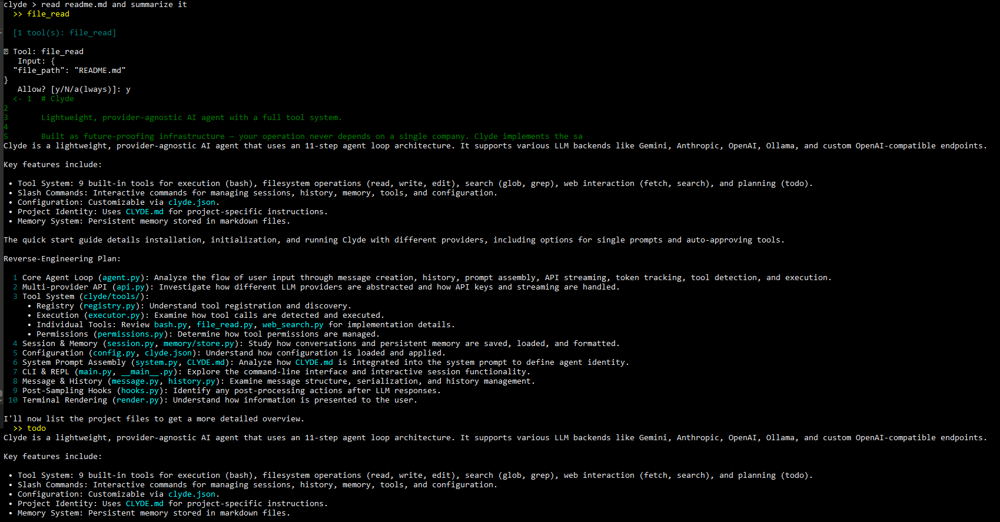
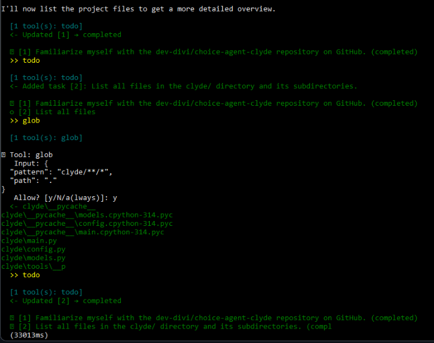
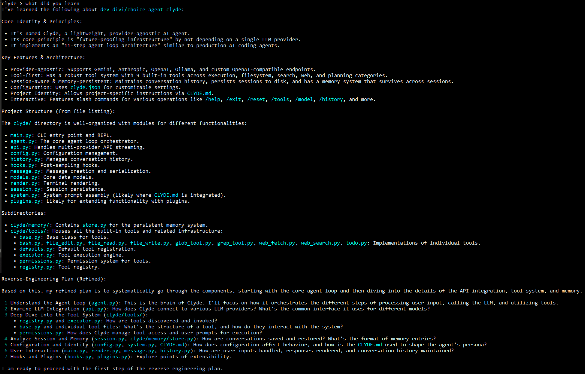

#  Clyde

Lightweight, provider-agnostic AI agent with a full tool system.

Built as future-proofing infrastructure — your operation never depends on a single company. Clyde is a clean-room implementation inspired by a publicly documented architecture — the same 11-step agent loop used by production AI coding agents, but runs against any LLM backend.

## Architecture

```
User Input → Message Creation → History Append → System Prompt Assembly
    → API Streaming → Token Tracking → Tool Detection → Tool Execution Loop
    → Response Rendering → Post-Sampling Hooks → Await Next Input
```

## Providers

| Provider | Model Examples | Config |
|----------|---------------|--------|
| **Anthropic** | claude-sonnet-4-20250514, claude-opus-4-20250514 | `ANTHROPIC_API_KEY` |
| **OpenAI** | gpt-4o, gpt-4-turbo | `OPENAI_API_KEY` |
| Gemini | gemini-2.5-flash, gemini-2.5-pro | `GEMINI_API_KEY` (free tier) |
| Ollama | llama3, qwen2.5-coder, mistral | Local, no key needed |
| Custom | Any OpenAI-compatible endpoint | `CLYDE_API_KEY` + `CLYDE_BASE_URL` |

> For full agent capabilities (multi-step planning, tool chaining), use Claude or GPT-4o. Free models like Gemini 2.5 Flash can handle simple tasks but can't handle complex workflows — multi-step work and tool chaining.

## Quick Start

```bash
# Install
pip install -e .

# Initialize config
clyde init

# Run with Gemini (free)
export GEMINI_API_KEY=your-key    # Get one free at https://aistudio.google.com/apikey
clyde --provider gemini --model gemini-2.0-flash

# Run with Anthropic (default)
export ANTHROPIC_API_KEY=sk-...
clyde

# Run with Ollama (local, free)
clyde --provider ollama --model llama3

# Run with OpenAI
export OPENAI_API_KEY=sk-...
clyde --provider openai --model gpt-4o

# Single prompt (non-interactive)
clyde "Find all TODO comments in this project"

# Auto-approve tools (no permission prompts)
clyde --auto-tools
```

> **Windows users:** Use `setx GEMINI_API_KEY "your-key"` instead of `export`, then restart your terminal.

## Demo






## Built-in Tools (9)

| Tool | Category | Description |
|------|----------|-------------|
| `bash` | execution | Execute shell commands |
| `file_read` | filesystem | Read files with line numbers |
| `file_write` | filesystem | Create or overwrite files |
| `file_edit` | filesystem | Surgical string replacements |
| `glob` | search | Find files by pattern |
| `grep` | search | Search file contents with regex |
| `web_fetch` | web | Fetch content from URLs |
| `web_search` | web | Search the web via DuckDuckGo (no API key) |
| `todo` | planning | Task tracking for multi-step work |

## Slash Commands

```
/help              Show available commands
/exit              Exit Clyde
/reset             Reset conversation
/compact           Compact conversation history
/history           Show conversation summary
/sessions          List saved sessions
/memory            Show memory entries
/tools             List available tools
/model <name>      Switch model mid-session
/provider <name>   Switch provider mid-session
/structured <msg>  Force JSON structured output
/usage             Show token usage
/config            Show current config
/todo              Show current task list
/diff              Show session activity (files touched, commands run)
/export [path]     Export conversation to JSON file
```

## Configuration

Create `clyde.json` in your project root (or run `clyde init`):

```json
{
  "provider": {
    "provider": "gemini",
    "model": "gemini-2.0-flash",
    "temperature": 0.7,
    "max_tokens": 8192
  },
  "agent": {
    "max_turns": 25,
    "compact_after": 40,
    "auto_compact": true,
    "stream": true,
    "tool_permission_mode": "prompt"
  },
  "session": {
    "sessions_dir": ".clyde_sessions",
    "memory_dir": ".clyde_memory",
    "auto_save": true
  },
  "identity_file": "CLYDE.md"
}
```

## Project Identity

Create a `CLYDE.md` file in your project root to give Clyde project-specific instructions. This gets included in the system prompt.

## Memory System

Clyde has persistent memory that survives across sessions. Memory entries are stored as markdown files in `.clyde_memory/` with YAML frontmatter.

## Project Structure

```
clyde/
├── __init__.py          # Package init
├── __main__.py          # python -m clyde support
├── main.py              # CLI entry point and REPL
├── agent.py             # The Agent Loop (core orchestrator)
├── api.py               # Multi-provider API streaming
├── config.py            # Configuration management
├── history.py           # Conversation history
├── hooks.py             # Post-sampling hooks
├── message.py           # Message creation and serialization
├── models.py            # Core data models
├── render.py            # Terminal rendering (Rich)
├── session.py           # Session persistence
├── system.py            # System prompt assembly
├── memory/
│   ├── __init__.py
│   └── store.py         # Persistent memory store
└── tools/
    ├── __init__.py
    ├── base.py           # Tool base class
    ├── bash.py           # Shell execution
    ├── defaults.py       # Default tool registration
    ├── executor.py       # Tool execution engine
    ├── file_edit.py      # File editing
    ├── file_read.py      # File reading
    ├── file_write.py     # File writing
    ├── glob_tool.py      # File search
    ├── grep_tool.py      # Content search
    ├── permissions.py    # Permission system
    ├── registry.py       # Tool registry
    ├── web_fetch.py      # URL fetching
    ├── web_search.py     # DuckDuckGo search
    └── todo.py           # Task tracking
```

## FAQ

**How does Clyde compare to OpenClaw / other AI agent frameworks?**

OpenClaw is a Swiss Army knife factory. Clyde is a really good pocket knife.
